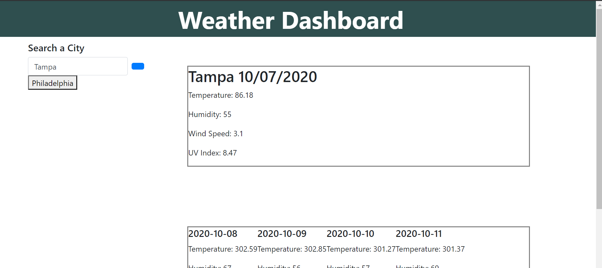

# weather_dashboard
[Weather Dashboard](https://kim-tor.github.io/weather_dashboard/)
========================

# Description

For this assignment the goal was to create a weather dashboard that allowed you as the traveler to input any city
and it would retrieve the data on the current weather as well as the 5 day forecast. The website should also save
your searches on the side and allow them to be clickable if you were to want to check an area that you had recently
looked at. 

# Installation
To begin I created the basic html that was going to be needed to hold all of the data that was going to be retrieved. 
Using Jquery I created the elements and then pushed them into the html. Using ajax calls I was able to gather the data 
from the open weather map api. I also used moment.js again to obtain the date information. 

# Problems
I was unsure of how to display the weather icons. I saw that they were part of the data that came from the api response.
I also had an issue with generating my list of searches. Upon reloading the page my last search was the only one that came up. 
I tried creating an array to hold all the searches and then thought that they would all load however that was not the case. 
I also couldn't get my icon to work for the search button. I feel like I had a lot of little nuances that I struggled to figure out.

An issue that I noticed happening randomly is that some times I would get a fail to load error, that really confused me. I think
it might have something to do with the api call issues I had with the CORS.

# Credits
One of the memebers for my group project (Anna C) helped us (our group) with how to get started with grabbing the UV index. 
I also used the cors link that was provided by one of our TA's. When I first started the assignment I was able to do api calls
but towards the end of completing it it started giving me that error. By inputting that beginning to my URL I was able to access
my api call. 

https://help.highbond.com/helpdocs/analytics/142/scripting-guide/en-us/Content/lang_ref/functions/r_substr.htm

\https://fontawesome.com/icons/search-location?style=solid

https://momentjs.com/
